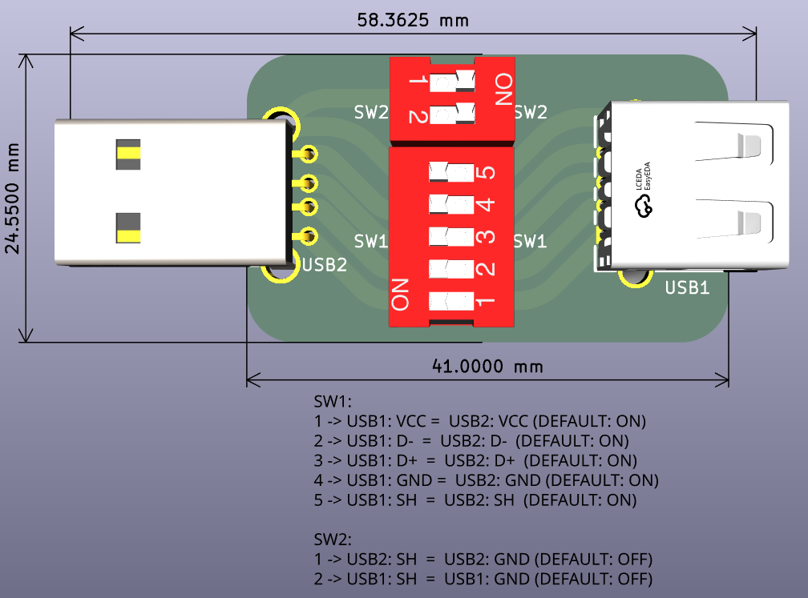
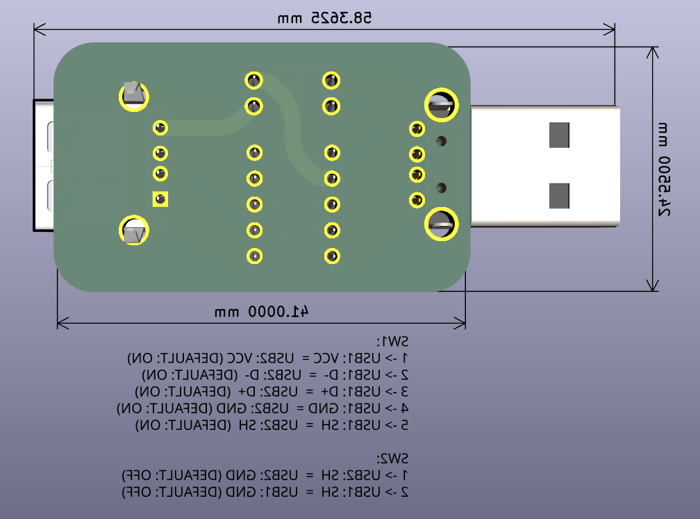

# USBIsolator

Simple USB isolator board project (compact production version).

This is the smaller and simpler variant currently used in production.

- For the full version, see [USBIsolator](../USBIsolator/).
- The same switch-function cheatsheet is included below.

## Project folders:

- [USBIsolator](../USBIsolator/) - full version (with cheatsheet)
- [USBIsolator.alt](./) - compact production version

## Production files:

- [USBIsolator production](../USBIsolator/production/)
- [USBIsolator.alt production](production/)

## Cheatsheet

- [USBIsolator.odt](../USBIsolator.odt)

```text
SW1:
1 -> USB1: VCC =  USB2: VCC (DEFAULT: ON)
2 -> USB1: D-  =  USB2: D-  (DEFAULT: ON)
3 -> USB1: D+  =  USB2: D+  (DEFAULT: ON)
4 -> USB1: GND =  USB2: GND (DEFAULT: ON)
5 -> USB1: SH  =  USB2: SH  (DEFAULT: ON)

SW2:
1 -> USB2: SH  =  USB2: GND (DEFAULT: OFF)
2 -> USB1: SH  =  USB1: GND (DEFAULT: OFF)
```

## Images

### USBIsolator.alt (production version)




