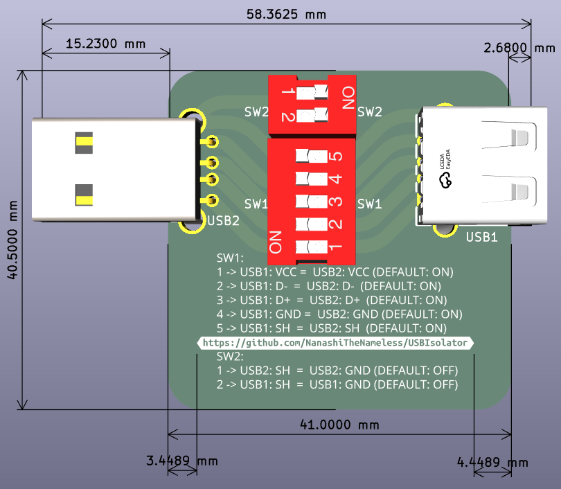
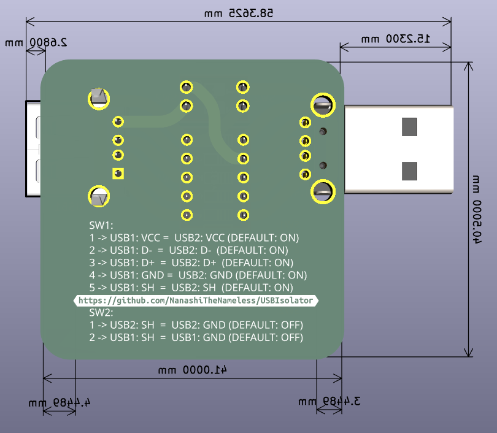

# USBIsolator

Simple USB isolator board project (full version).

This is the full variant of the design.

- Includes the switch-function cheatsheet below.
- For the smaller production variant, see [USBIsolator.alt](../USBIsolator.alt/).

## Project folders:

- [USBIsolator](./) - full version (with cheatsheet)
- [USBIsolator.alt](../USBIsolator.alt/) - compact production version

## Production files:

- [USBIsolator production](production/)
- [USBIsolator.alt production](../USBIsolator.alt/production/)

## Cheatsheet

- [USBIsolator.odt](../USBIsolator.odt)

```text
SW1:
1 -> USB1: VCC =  USB2: VCC (DEFAULT: ON)
2 -> USB1: D-  =  USB2: D-  (DEFAULT: ON)
3 -> USB1: D+  =  USB2: D+  (DEFAULT: ON)
4 -> USB1: GND =  USB2: GND (DEFAULT: ON)
5 -> USB1: SH  =  USB2: SH  (DEFAULT: ON)

SW2:
1 -> USB2: SH  =  USB2: GND (DEFAULT: OFF)
2 -> USB1: SH  =  USB1: GND (DEFAULT: OFF)
```

## Images

### USBIsolator (full version)




